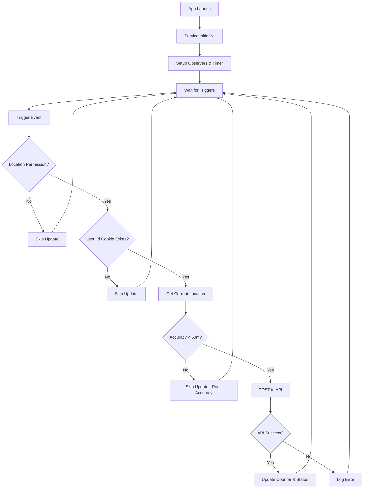

# 📍 LocationUpdateService Documentation

## Overview

The `LocationUpdateService` is a comprehensive location tracking system that automatically posts user location updates to the API (`https://mikmik.site/Location_updater.php`) in various scenarios while respecting user permissions and privacy.

## ✨ Features

### 🔄 **Automatic Triggers**
- **App Lifecycle Events**: Start, close, background, device lock
- **Timer-Based**: Every 10 minutes (configurable)
- **WebView Refresh**: On every page load/refresh
- **Manual Triggers**: Programmatic location updates

### 🔒 **Security & Privacy**
- ✅ Only operates when location permission is granted
- ✅ Only posts when `user_id` cookie exists
- ✅ Validates location accuracy (< 50 meters)
- ✅ Lazy initialization to prevent premature permission requests

### 📊 **Monitoring & Debug**
- Real-time status tracking
- Update counter
- Comprehensive logging
- Debug information available

## 🏗️ Architecture

### Core Components

```swift
@MainActor
class LocationUpdateService: NSObject, ObservableObject {
    static let shared = LocationUpdateService()  // Singleton
    
    // Location Management
    private var locationManager: CLLocationManager?  // Lazy initialization
    private var currentLocation: CLLocation?         // Cached location
    
    // Timer Management  
    private var updateTimer: Timer?                  // 10-minute timer
    private var lastPostTime: Date?                 // Last update timestamp
    
    // Monitoring
    @Published var lastUpdateStatus: String         // Real-time status
    @Published var totalUpdatesSent: Int           // Update counter
}
```

## 🎯 Trigger Scenarios

### 1. **App Lifecycle Events**

| Event | Trigger | Description |
|-------|---------|-------------|
| App Start | `app_became_active` | User opens app |
| App Close | `app_will_terminate` | User closes app |
| Background | `app_entered_background` | App goes to background |
| Foreground | `app_will_resign_active` | App becomes inactive |
| Device Lock | `device_locked` | Screen locks |

### 2. **Timer-Based Updates**
```swift
private let updateInterval: TimeInterval = 600 // 10 minutes
```

### 3. **WebView Refresh**
```swift
// Triggered on every page load
LocationUpdateService.shared.onWebViewRefresh()
```

### 4. **Manual Triggers**
```swift
// Programmatic location update
LocationUpdateService.shared.manualLocationUpdate()
```

## 🔧 Implementation Details

### Lazy Initialization Pattern

The service uses lazy initialization to prevent triggering location permission dialogs during app startup:

```swift
private func ensureLocationManagerInitialized() {
    if locationManager == nil {
        setupLocationManager()
    }
}

private func setupLocationManager() {
    if locationManager == nil {
        locationManager = CLLocationManager()
    }
    locationManager?.delegate = self
    locationManager?.desiredAccuracy = kCLLocationAccuracyBest
    locationManager?.distanceFilter = 10.0
}
```

### Permission Checking

```swift
private func isLocationPermissionGranted() -> Bool {
    let authStatus = CLLocationManager.authorizationStatus()
    return authStatus == .authorizedWhenInUse || authStatus == .authorizedAlways
}
```

### Cookie Validation

```swift
private func extractUserIdFromCookies() async -> String? {
    do {
        let cookies = try await websiteDataStore.httpCookieStore.allCookies()
        let userIdCookie = cookies.first { cookie in
            cookie.domain.contains("mikmik.site") && cookie.name == "user_id"
        }
        return userIdCookie?.value
    } catch {
        return nil
    }
}
```

### Location Accuracy Validation

```swift
// API requirement: accuracy must be < 50 meters
guard location.horizontalAccuracy < 50.0 else {
    print("📍 Location accuracy too poor: \(location.horizontalAccuracy)m")
    return
}
```

## 🚀 API Integration

### Endpoint Configuration
```swift
private let apiURL = "https://mikmik.site/Location_updater.php"
```

### Request Format
```json
{
    "user_id": "string",
    "latitude": double,
    "longitude": double,
    "accuracy": double
}
```

### Response Handling
```swift
if let success = jsonResponse["success"] as? Bool {
    if success {
        totalUpdatesSent += 1
        lastUpdateStatus = "✅ Success (\(trigger))"
    } else {
        let message = jsonResponse["message"] as? String ?? "Unknown error"
        lastUpdateStatus = "❌ API Error: \(message)"
    }
}
```

## 📱 Integration Guide

### 1. **AppDelegate Integration**

```swift
// AppDelegate.swift
private func setupLocationUpdateService() {
    let locationService = LocationUpdateService.shared
    print("📍 AppDelegate: Location update service initialized")
    
    // Don't start location services here - let onboarding handle permissions
    print("📍 AppDelegate: Location services will start after proper permission flow")
}
```

### 2. **MainViewController Integration**

```swift
// MainViewController.swift
private func setupLocationUpdateService() {
    let locationService = LocationUpdateService.shared
    
    // Only start if permission already granted
    let authStatus = CLLocationManager.authorizationStatus()
    if authStatus == .authorizedWhenInUse || authStatus == .authorizedAlways {
        locationService.startLocationServices()
    }
}

// WebView refresh trigger
func webView(_ webView: WKWebView, didFinish navigation: WKNavigation!) {
    // ... existing code ...
    LocationUpdateService.shared.onWebViewRefresh()
}
```

## 🐛 Debug & Monitoring

### Real-time Status Monitoring

```swift
// Access current status
let service = LocationUpdateService.shared
print("Status: \(service.lastUpdateStatus)")
print("Total Updates: \(service.totalUpdatesSent)")
```

### Debug Information

```swift
let debugInfo = await LocationUpdateService.shared.getDebugInfo()
print("Debug Info: \(debugInfo)")

// Output example:
[
    "location_permission": 3,
    "location_services_enabled": true,
    "user_id": "abc123...",
    "current_location": 37.7749,
    "last_update_status": "✅ Success (webview_refresh)",
    "total_updates_sent": 42,
    "last_post_time": "2024-12-XX XX:XX:XX",
    "update_interval": 600.0,
    "api_url": "https://mikmik.site/Location_updater.php"
]
```

### Console Logging

The service provides detailed logging with `📍` prefix:

```
📍 [LocationUpdateService] =================================
📍 [LocationUpdateService] Location update triggered by: webview_refresh
📍 [LocationUpdateService] =================================
📍 [LocationUpdateService] Found user_id cookie: abc123...
📍 [LocationUpdateService] 🚀 POSTING LOCATION TO API
📍 [LocationUpdateService] user_id: abc123...
📍 [LocationUpdateService] latitude: 37.7749
📍 [LocationUpdateService] longitude: -122.4194
📍 [LocationUpdateService] accuracy: 15.0
📍 [LocationUpdateService] trigger: webview_refresh
📍 [LocationUpdateService] Response status: 200
📍 [LocationUpdateService] ✅ Location update successful
📍 [LocationUpdateService] ✅ Location update completed for trigger: webview_refresh
```

## ⚙️ Configuration

### Timer Interval
```swift
private let updateInterval: TimeInterval = 600 // 10 minutes

// To modify, change the value and restart the service
```

### Location Accuracy
```swift
locationManager?.desiredAccuracy = kCLLocationAccuracyBest
locationManager?.distanceFilter = 10.0 // Update every 10 meters
```

### API Accuracy Requirement
```swift
// Must be < 50 meters as per API specification
guard location.horizontalAccuracy < 50.0 else { return }
```

## 🔄 Flow Diagram



## 🧪 Testing Scenarios

### Test Cases

1. **Fresh Install**
   - ✅ No permission dialog on app launch
   - ✅ Service initializes without location manager
   - ✅ Location manager created only when needed

2. **Permission Granted**
   - ✅ Location services start automatically
   - ✅ Updates post successfully to API
   - ✅ All triggers work correctly

3. **Permission Denied**
   - ✅ No location requests made
   - ✅ Service skips updates gracefully
   - ✅ No crashes or errors

4. **No user_id Cookie**
   - ✅ Service skips API posts
   - ✅ Logs appropriate message
   - ✅ Continues monitoring for cookie

5. **Poor Location Accuracy**
   - ✅ Updates skipped when accuracy >= 50m
   - ✅ Service waits for better accuracy
   - ✅ Logs accuracy information

### Manual Testing Commands

```swift
// Test manual trigger
LocationUpdateService.shared.manualLocationUpdate()

// Check current status
print(LocationUpdateService.shared.lastUpdateStatus)

// Get debug information
Task {
    let debug = await LocationUpdateService.shared.getDebugInfo()
    print("Debug: \(debug)")
}
```

## 🚨 Troubleshooting

### Common Issues

| Issue | Cause | Solution |
|-------|-------|----------|
| No updates sent | Missing user_id cookie | Wait for user login |
| Permission dialog on launch | Early CLLocationManager init | Check lazy initialization |
| Poor accuracy rejections | GPS signal issues | Wait for better signal |
| API errors | Network/server issues | Check API endpoint |

### Status Messages

| Status | Meaning |
|--------|---------|
| `"Not started"` | Service not yet triggered |
| `"Location permission denied"` | No location access |
| `"user_id cookie not found"` | User not logged in |
| `"Failed to get location"` | GPS/location error |
| `"Location accuracy too poor"` | Accuracy >= 50 meters |
| `"✅ Success (trigger)"` | Update posted successfully |
| `"❌ API Error: message"` | Server error |
| `"Network error: description"` | Connection issue |

## 📝 Best Practices

### 1. **Permission Handling**
- Always check permission before requesting location
- Let onboarding flow handle initial permission requests
- Gracefully handle permission denial

### 2. **Performance**
- Use cached location when recent (< 5 minutes)
- Background thread for network requests
- Timeout location requests (10 seconds)

### 3. **Error Handling**
- Log all errors for debugging
- Fail gracefully without crashing
- Provide meaningful status messages

### 4. **Privacy**
- Only operate with explicit permissions
- Respect user cookie preferences
- Validate location accuracy

## 🔮 Future Enhancements

### Potential Improvements

1. **Background Location**
   - Add background location capability
   - Implement significant location changes
   - Background app refresh support

2. **Enhanced Accuracy**
   - Multiple location samples
   - Kalman filtering
   - Motion detection

3. **Offline Support**
   - Queue updates when offline
   - Retry failed requests
   - Local storage backup

4. **Analytics**
   - Update success rates
   - Performance metrics
   - Usage statistics

5. **Configuration**
   - Dynamic update intervals
   - Accuracy thresholds
   - Custom API endpoints

---

## 📄 Version History

| Version | Date | Changes |
|---------|------|---------|
| 1.0 | 2024-12 | Initial implementation |
| 1.1 | 2024-12 | Fixed permission timing issue |
| 1.2 | 2024-12 | Added comprehensive documentation |

---

*For additional support or questions, contact the development team.* 